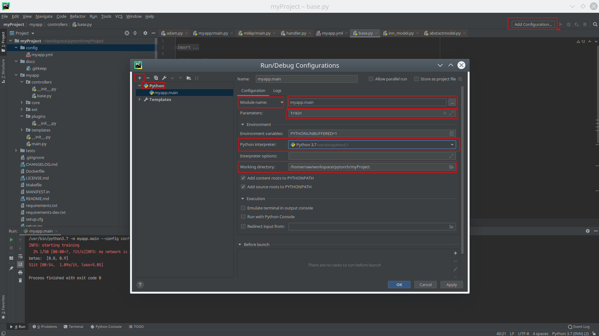
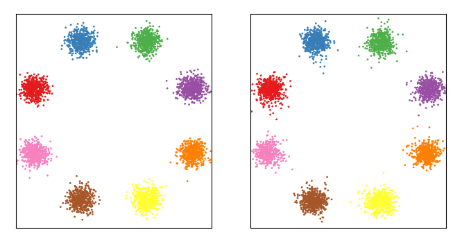

- [Introduction](#introduction)
- [Installation](#installation)
- [Gettings started](#gettings-started)
  * [install dependencies](#install-dependencies)
  * [pyCharm setup for running/debugging](#pycharm-setup-for-running-debugging)
  * [run from command-line](#run-from-command-line)
- [Basics](#basics)
  * [First run](#first-run)
  * [The application object](#the-application-object)
    + [enabling modules](#enabling-modules)
  * [Configuration](#configuration)
    + [notes on the config options](#notes-on-the-config-options)
    + [adding your own config section](#adding-your-own-config-section)
    + [Getting used to the config system](#getting-used-to-the-config-system)
  * [Hooks and Filters](#hooks-and-filters)
- [Interfaces and Handlers](#interfaces-and-handlers)
- [Toy8 Tutorial](#toy8-tutorial)
  * [Add a nice progressbar](#add-a-nice-progressbar)
  * [Checkpointing](#checkpointing)
- [VAE](#vae)

# Introduction

The aim of this project is to make it easier to start working on inverse problems.
NF4IP Based on [FrEIA from Heidelberg University](https://github.com/VLL-HD/FrEIA). 
While FrEIA provides a toolbox for building invertible networks, NF4IP uses this toolbox 
to offer a selection of ready-to-use network architectures.

In addition, NF4IP already offers useful features that simplify the development 
of your machine learning application:

* powerful configuration options with defaults, config files and commandline arguments.
* a code generator to give you a quick start with your project
* checkpointing: automatically save your learning progress and restore from it.
* Filter/Hook system to customize the application and plug your code into the library
* Plugin/Extension System to extend the functionality
* These extensions are currently available:
    * NF implementation
    * Tensorboard logging
    * Variational Autoencoder

# Installation
To install NF4IP, clone this repository, enter the cloned directory and install it locally using pip:
```bash
git clone https://gitlab.hzdr.de/HelmholtzAI/innforinverseproblems.git
cd innforinverseproblems
pip install -r requirements.txt
pip install -e setup.py
```
The -e will make an editable install, so you can edit the NF4IP library any time and see the effect instantly.

# Gettings started

you can start generating your first project by executing:
```
NF4IP generate project <targetDir>
```
where <targetDir> is the directory where the new project will be generated.
This tutorial assumes that you used the default "myapp" label name.

After executing this command and answering all questions, you can open the targetDir in your favorite
IDE. If you have no preference, we recommend the free
[pyCharm community edition](https://www.jetbrains.com/de-de/pycharm/).

The directory structure created is basicly a [Cement 3.0](https://docs.builtoncement.com)-Project.
While Cement has its own documentation, which should be consulted if there are open questions,
the NF4IP documentation will already give you everything you need to know to start your first project.

## install dependencies
to install the dependencies, run:
```
pip install -r requirements.txt
```

## pyCharm setup for running/debugging
follow the red rectangles from the screenshot to setup a run configuration for the new project:


After clicking "add configuration", select "+", then Python". The Project is prepared to run as python module,
so you have to select "Module name" instead of "Script path". as module name, you enter the name you specified 
as "App label" followed by ".main".

In the "Parameters" field, you can enter subcommands and configuration parameters for your application.
Also make sure to select the correct python interpreter and the root of your project as working directory.

Note that you can copy this configuration so you have one for frequently needed parameters.

## run from command-line
You can run your application without an IDE like that:
```
python -m myapp.main <parameters> <command>
```

# Basics
## First run
when you run your application without parameters, an usage/help overview will be printed. This overview 
is dynamically generated from your application and always up to date with its config options and available
commands.

By default, there is a "train" subcommand available which originates from "myapp/controllers/base.py".
You should visit that file, because this is where you will put your custom code. If you do, you see
an "train" method with an "@ex" annotation above it. If you want to add more commands, just copy 
this pattern.

If you run the command with
```
python -m myapp.main train
```
you will see the the INFO message printed on console.

## The application object
The application object is the basis of the project and is available in almost all contexts. 
The definition of the application object is located in myapp/main.py and inherits from the NF4IP 
application class. This class acts as the central configuration element (via meta-options) as well 
as the anchor point for accessing the individual components such as hooks, filters and logging.
Among other things, the controllers are registered here (which provide the individual sub-commands, 
e.g. also the "train" command), extensions are loaded and handlers are registered.

also see [The Application Object on Cement documentation](https://docs.builtoncement.com/getting-started/framework-overview#the-application-object)

### enabling modules
One if the most important things you want to do with the application class is to enable some NF4IP
modules. To do so, open the myapp/main.py file and add a module to the extensions array.
Cement core extensions are enabled by specifiyng thier label, while other extensions like the NF4IP
ones need a full path to be loaded. i.e. to load the inn extensions, you specify `'NF4IP.ext.inn'` there.

also see [Extensions on Cement documentation](https://docs.builtoncement.com/core-foundation/extensions-1)

## Configuration
All components of the NF4IP framework are controlled by a powerful configuration system - and if you
need some switches and config variables, you should use it too!

The configuration system is also based on cement, but has been extended to allow extensions to specify
default configurations and to add some quality of life improvements. **do not use the config_defaults meta option as
it can mess things up or at least does no come with the added features**

The configuration is evaluated before you start your command. There are 4 places where a config value can be set.

These are (in ascending priority):

- The default configuration of the module
- The project configuration file (config/myapp.yml)
- The configuration file which is specified by the `--config` command line parameter
- Command line options

Command line options therefore always have the highest priority and overwrite all other sources.
The default configuration plays a double role: it acts as a directory of what options are available
(for the commadline options), which types the parameters have and their default values.

The configuration is structured by modules. The default module is NF4IP, others e.g. vae or inn.
In the config files the configurations for these modules are grouped by module name.
For command line options the corresponding options get the module name separated with a dot as
prefix. The only exception is the NF4IP default module, which has no prefix on the command line.

also note that config options are generally underscore-delimited, but on the command line all 
underscores are changed to dashes.

If you add a boolean option like `enable: True` you will have to specify it as `--enable` or `--no-enable`
instead of `--enable False` on the command-line.

### notes on the config options
While it is based on the cement configuration system, the NF4IP configuration system is different from that. The
main reason for forking the config system was that we needed to extend it so our extentions can have their own configurations
registered early in the applications lifecycle.

for parsing the command-line-options, the data type of the option is automatically detected based on the default
value. only exception is when the default is a None type; then you need to specify the type of the argument manually.

lets say you have the `myoption: None` in your default configuration dictionary. then you can set the type by adding
the same option again starting with an underscore and specify its type:
```yaml
myoption: None
_myoption: str
```

If you specify the string "None" as value either by command line or by a configuration file, it be will automatically
converted to a None type.

### adding your own config section
When developing a module of some kind, you may want to add a separate config section for it. You can do it
by using `from NF4IP.core.config import handle_config` and `handle_config(app, 'mymodule', CONFIG)` in a place
where the app is already available but still before the pre_argument_parsing phase.
the handle_config method takes a dictionary of config options, detects their type and registers them as command line
arguments.

### Getting used to the config system
This section gives a quick tutorial on the configuration system.

You may already have noticed; the train command as this part in it:
```python
    my_option = self.app.config.get('myapp','my_option')
    self.app.log.info("my_option is {}".format(my_option))
```
this reads the my_option of the myapp config section and prints it. Now take a look at the top of the
"myapp/main.py"; there you see the definition of the default configuration for your app:
```python
# configuration defaults
CONFIG = {
    'my_option': 100
}
```
All you need to do when a new option is needet is to add it there and it will be available via the
`app.config` object.
- You can change its value to 99 and see the effect when running the train command again.
- Now go to the config/myapp.yml config file and comment in the my_option option and change its value.
You will notice that it overrides the default value.
- Create a file `config/experiment.yml` and add a paste this content:
    ```
    myapp:
      my_option: 133
    ```
  and start the application with the --config config/experiment.yml parameter to see this config in effect.
- lastly, just specify `--myapp.my-option 199` on the command line.

All config options from builtin modules can be overridden the same way.

Because this multi-level config system can be confusing, there is a default `config` command that
prints out the whole effective configuration. Try it:
```
python -m myapp.main config
```
You can do the above tests with this command and see the values changing. e.i. try:
```
python3 -m myapp.main --batch-size 100 config
```

You can use the 
`config/myapp.yml` for common/basic options and additional config files and additional configs using
the `--config` parameter for testing different parameter combinations.

## Hooks and Filters
Two main tools to adapt the existing algorithms are hooks and filters. A hook or filter is called
at defined positions in the program flow, so that previously defined code blocks (callback) are
executed for these hooks/filters. This makes it possible to "hook into" or influence the pre-defined
program flow. So for example the progressbar-extension hooks on the post_epoch hook to show the
progress. The functionality of hooks is described in detail here: 
[Hooks on Cement documentation](https://docs.builtoncement.com/core-foundation/hooks)

Filters are an NF4IP-specific extension and work very similar to hooks; the difference is that hooks
do not have a (noticed) return value, while filters must always return the same parameters they
received. And while every callback on a hook gets the same parameters passed, callbacks on the same
filter **receive the return value of the previous filter as argument**. This means you can have
multiple filter-callbacks on the same filter that do accumulate processing steps on the input!

Hooks are therefore used by NF4IP more for reporting purposes, while filters have an
influence on the values passed to them. It should be emphasised that both hooks and filters can
perform multiple functions/callbacks per hook/filter and these are sorted by priority.
Callbacks with the same priority are executed in the order of their definition. For example, if no
priority is given to 2 callbacks on the same hook/filter, they will receive the default priority of 0
and will be executed in the order of their definition. Smaller (and negative) numbers have a higher
priority than larger ones.

It is also important that the definition of the filter/hook parameters can be changed or extended later.
Therefore your hook/filter-callbacks should always take **kwargs as last argument to catch additional 
arguments.

An important filter is e.g. the train_input or val_input filter, which is executed on x and y of
each batch. If you want to swap x and y, you can do it this way:

```python
def swap(x, y, **kwargs):
    return y, x

self.app.filter.register('train_input', swap, 100)
self.app.filter.register('val_input', swap, 100)
```

While very flexible, hooks can also make it hard to follow the application flow. if you want to see if
and when a filter is called and which callbacks are executed, run your application with the `--debug`
switch.

# Interfaces and Handlers
To make parts of the code exchangeable, Cement offers the concept of interfaces and handlers.
see [Interfaces and Handlers on Cement documentation](https://docs.builtoncement.com/core-foundation/interfaces-and-handlers)
for a tutorial.

NF4IP utilizes this system to allow you to customize parts of the framework like loss functions, optimizers and network
structures.
 
An example is the inn_network_factory
interface that allows you to define a custom network structure. To do so, follow these steps (you need to have a command
that uses the inn model, like the toy8 example):
* Copy the NF4IP/ext/inn/networks/general_inn.py to your project to path myapp/networks/my_network.py
* In this copy
    * Rename the class to MyNetwork
    * change the label to 'my_network'
    * add a log line on the beginning of _get_structure function so we can confirm it is working: `self.app.log.info("my network is active!")`
* in your main.py
    * add `from .networks.my_network import MyNetwork` on top
    * in the post_setup method, add `self.handler.register(MyNetwork)`
        * if you follow the cement documentation, you would define the handler in the meta section of your main app. but
        because the interface is defined by the inn-plugin, it is not available when the main apps handlers are
        processed
* in your application configuration (myapp.yml) add:
    ```
    inn:
      inn_network_factory: my_network
    ```
   to actually use it.
* start you application (that uses the INN model, or just start the command inn toy8) and you will see the info line confirming that the new network is used!
    * alternatively, you can also use the `--debug` switch or a debug breakpoint to confirm it


# Toy8 Tutorial
You may already be familiar with the [toy8 tutorial from FreiA](https://github.com/VLL-HD/analyzing_inverse_problems/blob/master/toy_8-modes/toy_8-modes.ipynb)
The NF4IP project contains an implementation of it. You can run it with `NF4IP inn toy8`. Because the "inn toy8" command
is part of the inn extension, you also have that command available on your application too!

but lets implement it in your controller; copy and paste this to the top of your `myapp/controllers/base.py`:
```python
from torch.utils.data import DataLoader
from NF4IP.ext.inn.datasets.toy8_dataset import Toy8Dataset
from NF4IP.ext.inn.controllers.inn_toy8 import showResult
from NF4IP.ext.inn.models.inn_model import InnModel
```

and add this to your Base controller class and read the comments:
```python
    @ex(
        help='Train the toy8 network',
    )
    def toy8(self):
        self.app.log.info("starting training")

        """
        Here is a simple hook that prints out the current epoch and loss
        We will replace it later with the progressbar plugin.
        """
        def printer(i_epoch, loss, **kwargs):
            print(i_epoch, loss)
        self.app.hook.register('post_epoch', printer)

        """
        we have the toy8 dataset available and only need to setup a DataLoader for it.
        If you want a distributed dataset for the use with horovod, you have to setup it here.
        """
        test_loader = DataLoader(
            Toy8Dataset(test=True),
            batch_size=self.app.config.get('NF4IP', 'batch_size'), shuffle=True, drop_last=True)

        train_loader = DataLoader(
            Toy8Dataset(test=False),
            batch_size=self.app.config.get('NF4IP', 'batch_size'), shuffle=True, drop_last=True)

        """
        instantiate the actual InnModel with the data loaders, our app and the device it should run on.
        the self.app.device is automatically set on initialization time
        """
        model = InnModel(self.app, self.app.device, train_loader, test_loader)

        """
        start the triaining ...
        """
        model.train(train_loader)
        
        """
        ... and show the result when done.
        If everything worked, both images should look very similar.
        """
        showResult(self.app.device, model, test_loader)
```
for that to work, we need the correct configuration. Create a file config/toy8.yml and paste the configuration:
```yaml
inn:
  ndim_pad: 6
  ndim_z: 2
  lambd_predict: 3.
  lambd_latent: 300.
  lambd_rev: 400.

NF4IP:
  n_epochs: 50
  lr: 0.0005
  batch_size: 1600
  num_blocks: 8
  y_noise_scale: 0.1
  zeros_noise_scale: 0.05
  retain_graph: False
  max_batches_per_epoch: 8
  max_batches_per_validation: None
  loss_exp_scaling: True
  random_seed: 1987
```

for the command to actually respect it, you have to specify this configuration on the command line using
`--config config/toy8.yml`.
Now run the toy8 example and wait for 50 epochs to see the result:
```bash
/usr/bin/python3.7 -m myapp.main --config config/toy8.yml toy8
INFO: starting training
INFO: my network is active!
1 56.02047083112929
2 43.31949117448595
3 37.70264281166924
4 27.64492466714647
5 18.13070861498515
...
48 4.88847467634413
49 5.068010793791877
50 5.050738361146715
```


## Add a nice progressbar
our printing hook works (and is also a good example), but we want something more fancy. Remove the printing hook from the toy8 command and add
`'NF4IP.ext.progressbar'` to the extensions list of the myapp/main.py Meta class. Thats all, run again and see the progress!

## Checkpointing
Checkpointing saves the state of the model in intervals specified by the NF4IP `checkpoint_every_epochs` config value
if it has a name it can save to.
try running the example with --run toytest and abort it (CTRL+C) after at least 5 epochs. Then run it again - it should
resume where was canceled. Note that the default checkpointing interval is every 5 epochs.

On the last epoch, the model is also saved.
The checkpoint file contains a dictionary with at least these keys:

```python
    {
        'config': self.app.config.get_dict(),
        'i_epoch': self.i_epoch,
        'model_state_dict': self.model.state_dict(),
        'optimizer_state_dict': self.optimizer.state_dict()
    }
```
When restoring from a checkpoint, NF4IP automatically restores the configuration that was active when the learning
started - all configuration files and command line options are ignored except `--run` and `--overwrite`.

# VAE
the vae automatically hooks into the train_input / val_input steps when enabled. Please note that parallel training is
currently broken; you need to train the vae individually and then use the load config option to load it.